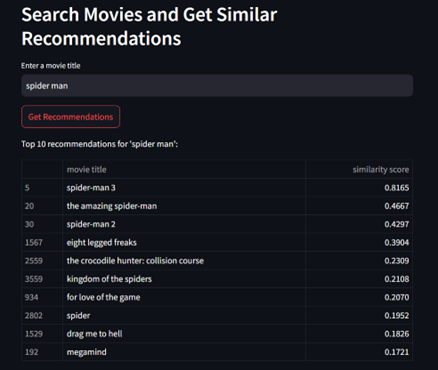

# Content-Based Movie Recommendation System 

This project explores different machine learning techniques for building a content-based movie recommendation system. It uses movie attributes to generate recommendations based on similarity, helping solve the cold start problem often seen in collaborative filtering.

## Tools Used
- Python (Google Colab)
- Streamlit (for frontend)
- Libraries: Pandas, NumPy, Scikit-learn, Matplotlib, Seaborn

## Dataset
- IMDB 5000+ Movie Dataset from Kaggle: https://www.kaggle.com/datasets/alexandrelemercier/movie-time

## Models Implemented
- TF-IDF + Cosine Similarity
- Word2Vec + Cosine Similarity
- KNN + Cosine Similarity

## Deployment
The final model was deployed as a web app using Streamlit for an interactive recommendation experience.


##  Sample Visualisations

###  Genre Distribution by Content Rating


### Correlation Matrix


###  IMDb Score by Content Rating


##  Streamlit App Preview

###  Create a New User Profile


###  Search and Get Movie Recommendations



##  Run the Streamlit App

To launch the interactive movie recommendation app locally:

```bash
# Step 1: Navigate to the app folder
cd app

# Step 2: Run the Streamlit app
streamlit run streamlit_app.py


The app will open in your web browser. You can enter a movie title and get personalised content-based recommendations.

